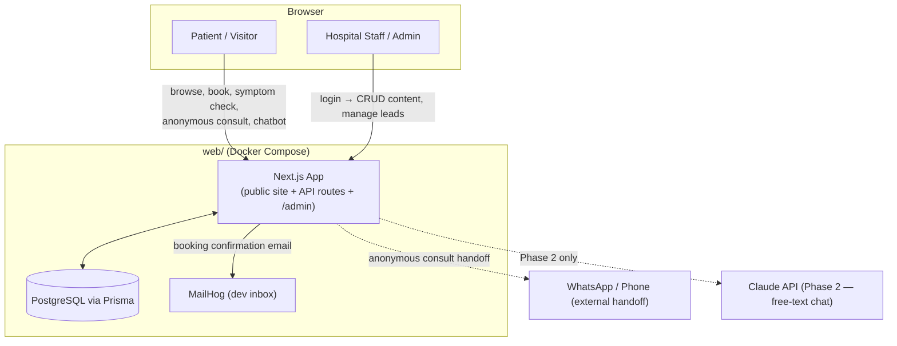

# Aaravya Hospital — Dynamic Website & Admin Panel

Rebuild of the static site at `../Existing-code/aaravya/` (live at aaravyahospital.com) as a database-backed, admin-manageable Next.js application, per the client brief in `../Proctology-Hospital-Website-Sitemap-Content-Brief (2).md`.

> **Status:** Phase 1 (MVP) build in progress. This README is the living reference for the project — update it as the implementation evolves.
>
> - [x] Step 1 — Next.js 16 + Tailwind v4 + shadcn/ui + Prisma 7 + Docker Compose (app/db/mailhog), verified locally.
> - [x] Step 2 — Real content seeded: 21 conditions, 21 procedures, 2 doctors, 28 FAQs, 80 media items, extracted from `Existing-code/aaravya/*.html`.
> - [x] Step 3 — Public page templates: home, about, doctors (list + 2 profiles), conditions (list + all 21 detail pages), procedures, FAQs, gallery, testimonials, contact, cost. All server-rendered from the DB, all verified 200 OK with zero console errors.
> - [x] Step 4 — Unified booking system: `/book` form (react-hook-form + Zod), server action writes to `Appointment`, Nodemailer sends both a coordinator notification and a patient confirmation email. Pre-fills condition/doctor from `?condition=`/`?doctor=` query params off the CTAs. Verified end-to-end via real browser automation: DB row + both emails confirmed in MailHog.
> - [x] Step 5 — Anonymous Video Consultation Hub: `/anonymous-consultation` + 5 category pages (Students/Women/IT Professionals/Police & Defence/Others) with tailored, destigmatizing copy, confidentiality badge throughout, nickname-only request form (no full name field), female-doctor preference on the Women page, WhatsApp as an alternative entry point, and a plain-language `/privacy` page. Reuses the same `Appointment` table (`isAnonymous: true`) — verified end-to-end: nickname-only row created, correct category, female-doctor preference correctly resolved to Dr. Dipti Prajapati.
> - [x] Step 6 — Rule-based AI symptom checker (`/symptom-checker`, 4-question flow, deterministic urgency triage, sessions logged to `SymptomCheckSession`) + site-wide chat widget (menu-driven: check symptoms / ask a question / book / talk to a coordinator, FAQ search backed by the real `Faq` table, red-flag keyword escalation). Replaced the old floating WhatsApp/call buttons with this single widget. Verified end-to-end via browser automation: mild symptoms → self-care, severe/heavy-bleeding → urgent with phone CTA, chat FAQ search returns real matches, red-flag phrases immediately escalate.
> - [x] Step 7 — SEO/GEO layer: `Hospital` schema site-wide, `MedicalWebPage`+`FAQPage` on every condition page, `Physician` on doctor pages, `MedicalProcedure` on procedure pages, `FAQPage` on `/faqs` — all generated straight from the same DB fields the visible page renders, so structured data can't drift from visible content. Dynamic `sitemap.xml` (63 URLs) and `robots.txt` explicitly allow-listing GPTBot/Google-Extended/PerplexityBot/ClaudeBot. Also wired in the site's real GTM/GA4 analytics IDs (recovered from the legacy site audit) via `next/script`. Verified: all JSON-LD blocks parse as valid JSON across every page type, full site route sweep clean.
> - [x] Step 8 — Admin panel: Auth.js (Credentials + bcrypt) protecting `/admin/*` via Next.js 16's `proxy.ts` (the renamed `middleware.ts` convention — also now defaults to the Node.js runtime). Full CRUD for Doctors, Conditions, Procedures, FAQs, Testimonials, Health Library articles, Cost Estimator rules, and Locations; a single Site Settings page (phone/WhatsApp/email/socials/analytics IDs); an Appointments/Leads dashboard with status filters and inline status updates. Login at `/admin/login` (`admin@aaravyahospital.com` / `ChangeMe123!` — **must change before any real deploy**). Verified end-to-end via browser automation across every resource: create, edit, delete, and appointment status changes all confirmed against the real database.
> - [ ] Step 9 — Full local QA pass against the verification checklist.

---

## 1. What this is

A single Next.js application that replaces ~50 hand-written static HTML pages with:
- A **database-backed public site** (doctors, conditions, procedures, blog, testimonials, gallery, FAQs, contact/locations) — content editable from an admin panel instead of hand-editing HTML.
- A **unified booking system** (in-clinic + teleconsult + anonymous requests), replacing the old PHP-mail-only `appointment.php`/`mailer.php` forms (which had no validation, no persistence, no anti-spam, and were broken on at least one page).
- The brief's headline new features: an **Anonymous Video Consultation Hub** (lifestyle-category self-selection), a **rule-based AI Symptom Checker**, and a **homepage chatbot widget**.
- SEO/GEO structured data (`MedicalWebPage`, `Physician`, `MedicalProcedure`, `FAQPage` JSON-LD) generated directly from the database, so visible content and structured data can never drift apart.
- A custom **`/admin`** panel (auth-gated) for non-technical staff to manage all of the above.

Everything runs locally first via Docker Compose. Hosting/deployment is a deliberately separate, later conversation (the goal there is $0–low cost).

## 2. Tech stack

| Layer | Choice | Why |
|---|---|---|
| Framework | Next.js 16 (App Router, TypeScript, RSC) | SSR/SSG for Core Web Vitals + SEO; one app for frontend, API, and admin |
| Styling/UI | Tailwind CSS v4 (CSS-first config, no `tailwind.config.js`) + shadcn/ui (Radix) + Framer Motion | Fast, accessible, consistent design system with room for polish |
| Database | PostgreSQL | Mature, free-tier-friendly (Neon/Supabase later), pairs well with Prisma |
| ORM | Prisma | Typed schema, migrations, easy seeding |
| Admin auth | Auth.js (NextAuth) Credentials provider | Simple, no external auth vendor needed |
| Forms/validation | react-hook-form + Zod | Shared client/server validation |
| Rich text | Tiptap | Lets staff edit long-form content without touching code |
| Email | Nodemailer + MailHog (dev) | Real transactional email later; MailHog gives a local inbox to test against now |
| Containerization | Docker Compose (`app`, `db`, `mailhog`) | One command to run everything locally |

## 3. Architecture



Full flowcharts (anonymous consult journey, symptom checker decision tree) live in the project plan: `~/.claude/plans/serene-discovering-stream.md`.

## 4. Folder structure (target)

```
web/
├── docker-compose.yml        # app + db + mailhog, own ports (app:3000, db:5433)
├── Dockerfile                 # multi-stage build (deps → build → runner)
├── prisma/
│   ├── schema.prisma
│   └── seed.ts                # real content extracted from Existing-code/*.html
├── src/
│   ├── app/                   # Next.js App Router routes
│   │   ├── (public)/          # home, doctors, conditions, treatments, blog, faqs, gallery, contact, cost
│   │   ├── admin/              # auth-gated CRUD panel
│   │   └── api/                 # route handlers (booking, symptom-checker, chatbot)
│   ├── components/
│   ├── lib/                    # prisma client, auth config, mailer, schema.org generators
│   └── content/                 # symptom-checker rule tree, chatbot canned Q&A config
└── README.md                   # this file
```

## 5. Data model (summary — see `prisma/schema.prisma` once written)

`Doctor`, `Condition`, `Procedure`, `LocationLandingPage` (city/keyword SEO variants of a Condition — see §7), `Faq`, `Testimonial`, `MediaItem` (gallery + testimonial images/videos, one model with a `category` filter), `Appointment` (unified booking + anonymous requests), `SymptomCheckSession`, `BlogPost`, `CostEstimatorRule`, `Location` (branch/contact info), `SiteSetting`, `AdminUser`.

## 6. Brand tokens (confirmed from the live static site)

```css
--color-primary: #7b9a40;   /* brand green — buttons, links, accents */
--color-accent:  #1FC5B1;   /* teal — counters, emergency CTA */
--color-heading: #1C2359;   /* navy — headings */
--color-body:    #5C5F71;   /* body text gray */

--font-heading: "Outfit", sans-serif;
--font-heading-alt: "Saira", sans-serif;
--font-body: "Inter", sans-serif;
```
Phone: `+91 87338 89957` · WhatsApp: `918733889957` · Email: `aaravyahospital@gmail.com`
Address: Aaravya Hospital, Swagat Status-1, above EAT PUNJAB, New C.G. Road, Chandkheda, Ahmedabad – 380013
(Postal code vs. map-embed pin mismatch, and two different Maps embed strings, found in the old site — reconcile with the client before launch.)
Existing analytics to carry over: GTM `GTM-PZ8M7LVZ`, GA4 `G-CKF6RLLS27`.

## 7. Migrating content from the static site

The static site (`../Existing-code/aaravya/`) was audited page-by-page. Key findings driving the data model and seed script:

- **21 condition pages** use a rich template (symptoms list, numbered treatment options, "why choose us", sidebar) → maps to the `Condition` model.
- **16 pages** are thin, city/keyword SEO variants of "Piles" only (e.g. `piles-treatment-in-ahmedabad.html` vs `-in-gujarat.html`) → collapse into **one** `Condition=Piles` plus a `LocationLandingPage` model (condition + location slug + short unique paragraphs), instead of duplicating whole pages.
- **3 separate FAQ sets exist** (10 on the homepage, 18 on `/faqs`, 7 embedded in one landing page) with no shared topic tagging — migrate all into one `Faq` table with a `topic`/`pageContext` field (new field, backfilled during migration).
- **Doctor profiles** have bio/qualifications/designation but **no registration number, no discrete years-of-experience field, no consultation hours** — these are new fields to collect from the client, not migratable.
- **Testimonials have no captions, patient names, or quote text** in the current markup (captions are baked into image files) — the new `MediaItem`/`Testimonial` model adds these fields going forward.
- **Forms had no server-side validation, no persistence, no CAPTCHA, and relied on PHP's local `mail()`** (no SMTP configured) — the new booking system fixes all of this by design.
- **Known live-site bugs, not to be replicated:** `contact.html`'s appointment modal posts to `action="#"` (broken); `appointment.html` is a fully dead/orphaned page with placeholder phone numbers.
- **Exclude from migration:** `.well-known.zip` (189MB stray SSL-validation artifact), `cgi-bin/` (hosting artifact).

## 8. Feature scope

**Phase 1 (this build):** full public site, unified booking, Anonymous Video Consultation Hub (form/WhatsApp handoff), rule-based AI Symptom Checker, homepage chatbot (canned Q&A), SEO/GEO JSON-LD layer, full admin panel, Docker Compose for local dev.

**Phase 2 (next):** LLM-backed free-text chat (Claude API) layered behind the same chat interface, embedded in-browser video consultation (self-hosted Jitsi), live Google Reviews integration, Hindi/multilingual toggle, AI receptionist/booking agent.

**Phase 3+ (later):** post-op AI check-in assistant, photo-based triage (requires clinical governance review first).

## 9. Running locally

```bash
cd web
docker compose up          # starts app (localhost:3000), db (5433), mailhog (localhost:8025-equivalent UI)
docker compose exec app npx prisma migrate deploy
docker compose exec app npx prisma db seed
```
Admin panel: `http://localhost:3000/admin` (seeded credentials documented in `prisma/seed.ts` once written — change before any real deployment).

## 10. Verification checklist

- [ ] `docker compose up` brings up all 3 containers cleanly
- [ ] Migrations + seed run without error
- [ ] Homepage renders hero/trust bar/condition links/testimonials
- [ ] A condition page renders with valid, visible-text-matching JSON-LD
- [ ] Booking form submits → row in `/admin` → email visible in MailHog
- [ ] Symptom checker reaches an urgency result
- [ ] Anonymous category page → request form submits with no forced full name
- [ ] Admin login works; editing content reflects immediately on the public site
- [ ] `sitemap.xml` / `robots.txt` generated and correct
- [ ] `tsc --noEmit` and lint pass
- [ ] Before any real deployment: seeded admin password (`admin@aaravyahospital.com` / `ChangeMe123!`) rotated, `NEXTAUTH_SECRET` regenerated, and `.env` values point at real production DB/SMTP (see `.env.example`)
